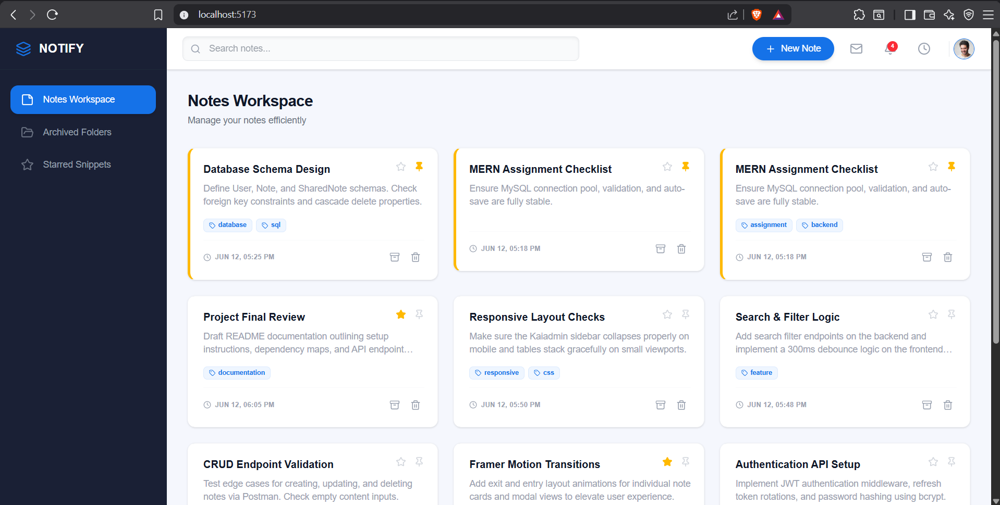
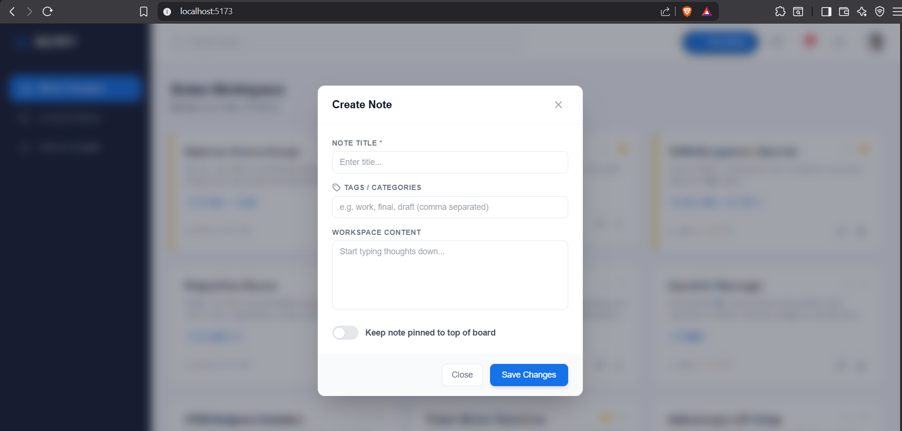
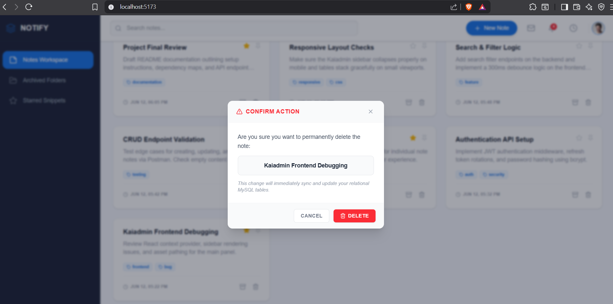
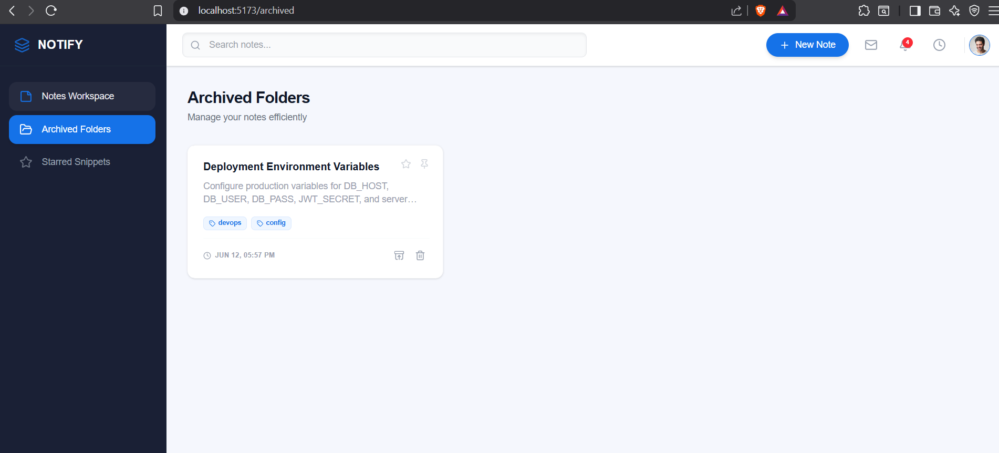
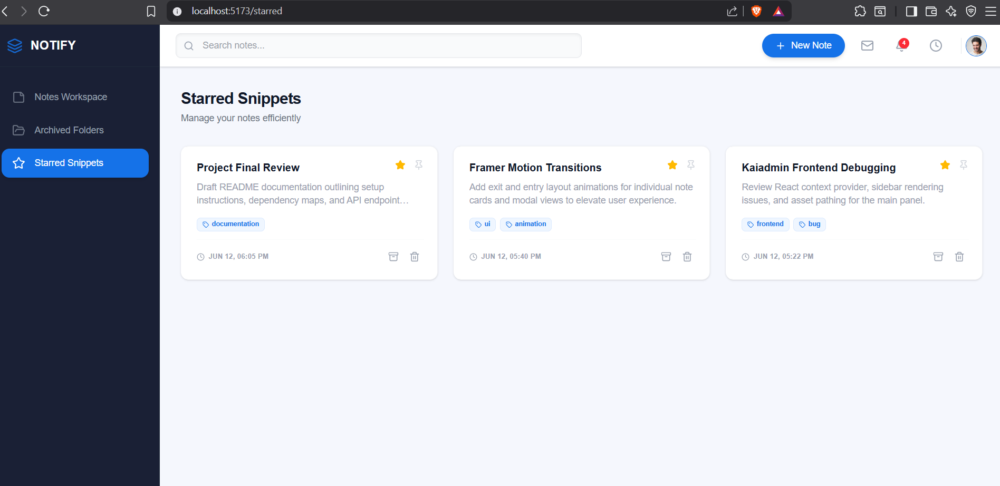

# Trainee Developer Assignment

## Overview
Output - 

NOTIFY: Full-Stack MERN Notes Management System Installation and Operational Documentation
This document provides a comprehensive step-by-step setup, installation, and architectural overview for the NOTIFY Notes Management System.

Architecture and System Layout
The application consists of a decoupled client-server pattern utilizing a centralized MySQL relational database setup, an Express backend REST API instance, and a single-page frontend application layout.

Views Mapping
Main Dashboard View (/): Accessible at localhost:5173, this view displays your core notes grid, real-time search interface, and active pinning structure as seen in image_84cd84cd9f.png.

Starred Snippets Folder (/starred): Filters your workspace elements to selectively render notes marked with high-priority star references as shown in image_84cd81png.

Archived Folders (/archived): Isolates non-active workspace entries to maintain dashboard organization as shown in image_84cd80png.

Part 1: Prerequisites
Before initiating setup, ensure the following software tools are installed on your machine:

Node.js: Version 18.x or higher.

npm: Distributed automatically with Node.js.

MySQL Server: Version 8.0 or higher.

Part 2: Database Initialization
Open your native MySQL terminal command interface or tool (such as MySQL Workbench) and log in.

Execute the following relational structure schema queries to set up the repository database and target table spaces:

SQL
CREATE DATABASE IF NOT EXISTS kaiadmin_notes_db;
USE kaiadmin_notes_db;

CREATE TABLE IF NOT EXISTS notes (
    id INT AUTO_INCREMENT PRIMARY KEY,
    title VARCHAR(255) NOT NULL,
    content TEXT NULL,
    pinned BOOLEAN DEFAULT FALSE,
    starred BOOLEAN DEFAULT FALSE,
    archived BOOLEAN DEFAULT FALSE,
    tags VARCHAR(255) NULL,
    createdAt TIMESTAMP DEFAULT CURRENT_TIMESTAMP,
    updatedAt TIMESTAMP DEFAULT CURRENT_TIMESTAMP ON UPDATE CURRENT_TIMESTAMP
);

-- Optimization lookup constraint index
CREATE INDEX idx_notes_sorting ON notes (pinned DESC, updatedAt DESC);
Part 3: Backend API Setup and Launch
1. Navigate to the API Folder Space
Open a terminal window and enter the backend workspace repository path:

Bash
cd backend/notes-api
2. Dependency Package Installation
Install the necessary backend runtime framework modules:

Bash
npm install
3. Environment File Configuration
Create a file named .env straight inside the root of your backend/notes-api/ directory path and add your system infrastructure connection parameters verbatim:

Ini, TOML
PORT=5000
DB_HOST=127.0.0.1
DB_USER=root
DB_PASSWORD=your_mysql_root_password
DB_NAME=kaiadmin_notes_db
4. Execute the Server Instance
Execute the startup command to launch your node backend service on port 5000:

Bash
node .\src\server.js
Upon successful initialization, your terminal output stream will state:

Plaintext
Production MySQL API Server running on port 5000
DATABASE STATUS: Connected successfully to MySQL instance!
Part 4: Frontend Client Setup and Launch
1. Navigate to the UI Project Folder
Open a second, separate terminal workspace layer and move down into the UI interface path directory:

Bash
cd frontend/notes-ui
2. Dependency Package Installation
Install the client compilation dependencies:

Bash
npm install
3. Start the Vite Local Server Engine
Run the development environment execution thread:

Bash
npm run dev
4. Open the Interface Link
Open your internet browser application window and route your active address locator bar straight to:

Plaintext
http://localhost:5173
Part 5: Complete Operational Instructions
Creating a New Note
Click the blue New Note button located at the upper-right control header row inside your navigation window as seen in image_84cd84cd9f.png.

An interactive popup panel stating Create Database Note will glide onto your viewing plain as shown in image_84cd9b.jpg and image_84cd98.jpg.

Supply a mandatory alphanumeric description parameter value inside the Note Title input block.

Input comma-separated keyword categorizations inside the Tags / Categories entry segment.

Compose your description blocks inside the Workspace Content textarea element.

Toggle the Keep note pinned to top of board slider input component if you want the record fixed permanently to your top container layout row.

Click Save Changes to commit the transaction directly into your active backend MySQL infrastructure.

Real-Time Auto-Save Functionality
The system monitors any interactive modifications executed inside the workspace textarea component space.

Exactly 1000ms after you stop typing your message strings, a cloud synchronizing HUD tracking toast elements pops up in the lower-right dashboard interface boundary corner.

This process automates record updates to prevent data loss during long text editing entries.

Organizing Records: Pinning, Starring, and Archiving
Pin / Unpin: Click the pin shape token badge situated directly on the upper right margin of an open card. Notes configured with this flag will prioritize over standard records and order at the top of your layout grids as seen in image_84cd84cd9f.png.

Star / Favorite: Click the star profile emblem inside the card components. Activating this state replicates the behaviors illustrated in image_84cd81png, pulling your card metrics into your private Starred Snippets navigation path directory.

Archive / Clean Workspace: Click the folder box archive toggle icon to clear rows from the primary Notes Workspace layer panel view. These records can be accessed, reviewed, or restored by navigating to the Archived Folders menu route view as showcased in image_84cd80png.

Deleting a Note Instance
Click the trash icon shortcut button on the footer boundary element of any targeted card row container.

The specialized Kaiadmin Confirm Action Alert Dialogue Overlay component box will display on-screen as demonstrated in image_84cd7e.jpg.

Verify the title parameter match inside the panel body description view.

Click the red Delete execution switch to process an absolute relational drop action block down your network route axis. The element updates your data array lists and clears rows from the view instantly.
This assignment has 3 parts:

1. Core Task (Mandatory)
2. Notes Backend (Optional)
3. Notes Frontend (Optional)

You must complete the Core Task.
You can choose Backend, Frontend, or both.

---

## 1. Core Task (Mandatory)

Fix bugs in the provided code and make sure the project runs correctly.

---

## 2. Backend Task (Optional)

Build a Notes API with following endpoints:

- POST /notes
- GET /notes
- GET /notes/:id
- PUT /notes/:id
- DELETE /notes/:id

---

## 3. Frontend Task (Optional)

Build a Notes UI:

- Show list of notes
- Create note
- Edit note
- Delete note

---

## Rules

- You can use Google / ChatGPT
- Do not copy full project from internet
- Keep code simple and readable

---

## Submission

- Push code to GitHub
- Share repository link

---

## Evaluation Criteria

We evaluate:
- Problem solving
- Code quality
- Understanding of basics
- Effort and learning ability

